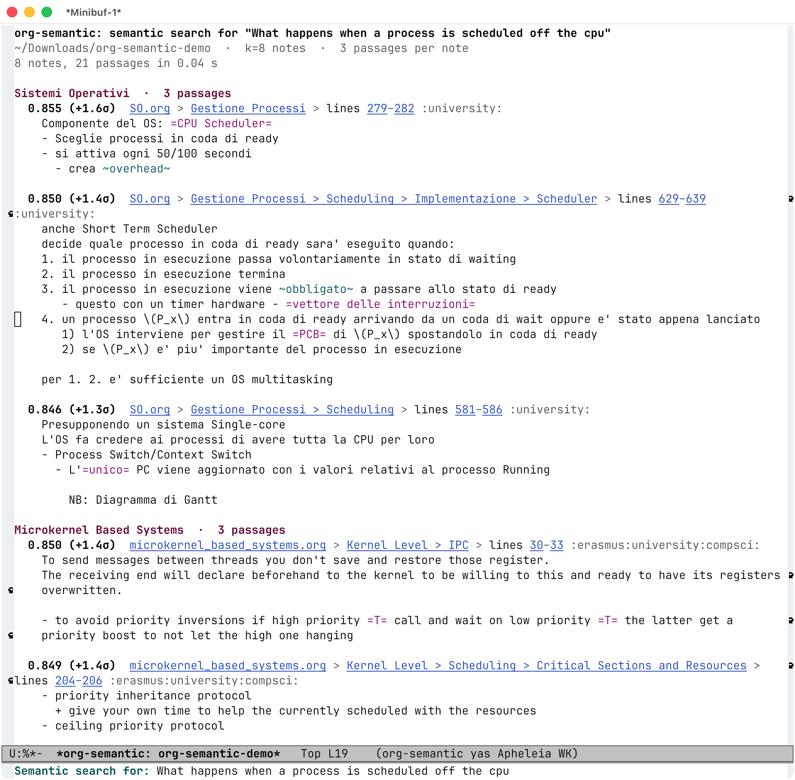

# org-semantic

Search a tree of org-mode notes by meaning or by words. One static binary, no
database, no Python. It runs as a one-shot command, or stays resident for Emacs
— over a pipe, never a port.

**[Full documentation](https://alberti42.github.io/org-semantic/)**

The screenshot and the commands below search [Daniel Bias's
braindump](https://github.com/denialbb/braindump), someone else's public vault
of 753 org notes in English and Italian, cloned into `braindump/`. So you can
run them as they stand.

## From Emacs



`M-x org-semantic-find` searches the vault the current buffer belongs to. The
question is in English, the note answering it is in Italian, and an English note
is ranked beside it.

`RET` goes to the line under point, `n` and `p` walk the passages, `k` and `+`
widen the list or deepen it, `g` asks again. It is a `next-error` client, so
`M-g M-n` walks the hits from anywhere, and `f` shows each passage in its note
as point reaches it.

## From the CLI

```console
$ org-semantic index braindump/roam --both --model e5-small
  20200924090307-elementi_di_probabilita_e_statistica.org: could not be read, so it is not indexed: stream did not contain valid UTF-8
753 org files
  256 sections were divided to fit the 350-token budget
3038 chunks · 3038 to embed · scanned in 1.5s
model loaded in 0.9s
embedded 3038 chunks in 77.8s (39/s)
wrote braindump/roam/.org-semantic/semantic/e5-small (4.7 MB of vectors) in 80.3s total
  20200924090307-elementi_di_probabilita_e_statistica.org: could not be read, so it is not indexed: stream did not contain valid UTF-8
753 org files
lexical index: 2863 chunks written in 0.4s

$ org-semantic search braindump/roam "what happens when a process is scheduled off the cpu" 2 --per-file 2

0.860 (+1.7σ)  Sistemi Operativi > Gestione Processi
       SO.org:278
       id:5c91241d-3da3-47e6-b27a-9afe7e0b4ff0
       :university:
       Componente del OS: =CPU Scheduler= - Sceglie processi in coda di ready - si attiva ogni 50/100 secondi - crea…

0.860 (+1.7σ)  Sistemi Operativi > Gestione Processi > Scheduling > Implementazione > Scheduler
       SO.org:628
       id:5c91241d-3da3-47e6-b27a-9afe7e0b4ff0
       :university:
       anche Short Term Scheduler decide quale processo in coda di ready sara' eseguito quando: 1. il processo in esecuzione passa…

0.854 (+1.5σ)  Microkernel Based Systems > Kernel Level > Scheduling > in Microkernel Based Systems
       microkernel_based_systems.org:194
       id:ad8e431b-7af6-4eb9-99a7-41af9cd0c4ce
       :erasmus:university:compsci:
       Different ideas: - Brian Ford - CPU Inheritance Scheduling + event \to mk \to root scheduler \to particular scheduler +…

0.850 (+1.4σ)  Microkernel Based Systems > Kernel Level > IPC
       microkernel_based_systems.org:29
       id:ad8e431b-7af6-4eb9-99a7-41af9cd0c4ce
       :erasmus:university:compsci:
       To send messages between threads you don't save and restore those register. The receiving end will declare beforehand to the…

[model load 733ms · query embed 8ms · search over 3038 vectors 1.0ms]
```

The top note's title — *Sistemi Operativi* — shares no word with the question.
Finding what you can describe but cannot name is the whole point of
org-semantic, and each score carries a σ because a raw cosine cannot be read
without one.

One note in that vault is UTF-16, and `index` says so once per index rather than
passing over it in silence.

Most of that three-quarters of a second is the model loading, paid once per
process. For anything interactive, run `org-semantic serve` instead: it keeps
the model and the vectors resident, and answers in 7–9 ms by meaning or 3 ms by
word — fast enough to search as you type.

## What it touches

Your notes are read and never written: everything it builds goes in one
`.org-semantic/` directory beside them, and deleting it leaves the vault exactly
as it was. Nothing about them leaves the machine — no service, no account, no
API key, no telemetry. The only thing that ever touches the network is fetching
the model and a small language classifier, once each, after which it works
offline. [What it
touches](https://alberti42.github.io/org-semantic/#what-it-touches) says it in
full, and points at more public vaults if you would rather try it on notes that
are not yours.

## Install

```sh
cargo install --git https://github.com/alberti42/org-semantic
```

Requires a Rust toolchain. Nothing else — no Python, no system ONNX Runtime, no
package manager. The embedding model downloads on first use.

## At a glance

```sh
org-semantic index  ~/notes --both      # build both indexes
org-semantic search ~/notes "how did we decide to do it that way"  # by meaning
org-semantic search ~/notes 'tag:meeting budget' --lexical         # by word
org-semantic serve                      # JSON-RPC over stdio, for an editor
```

`org-semantic -h` explains every command; how a vault is indexed — languages,
excluded subtrees, what happens to `src` blocks — lives in a JSON policy file,
starting from [`config.example.json`](config.example.json).

## The Emacs package

It is in [`lisp/`](lisp/). There are no default global bindings and there will
not be — `C-c` and a plain letter is yours rather than a package's — so a
recommendation is as far as this goes:

```elisp
(use-package org-semantic-results
  :load-path "/path/to/org-semantic/lisp"
  :custom ((org-semantic-executable "/path/to/org-semantic")
           (org-semantic-vault-root "~/notes"))
  :bind (("C-c n s" . org-semantic-find)
         ("C-c n S" . org-semantic-find-at-point)
         ("C-c n R" . org-semantic-reindex))
  ;; Show each passage in its note as point reaches it.
  :hook (org-semantic-results-mode . next-error-follow-minor-mode)
  ;; Reindex a vault as its notes are saved.
  :init (org-semantic-auto-reindex-mode 1))
```

`org-semantic-vault-root` is the one setting that has to be right: it says which
directory your notes are, and every buffer that says nothing else — `*scratch*`,
the agenda — searches it. With several vaults, leave it nil and let each one
declare itself in its own `.dir-locals.el`. [Searching from
Emacs](https://alberti42.github.io/org-semantic/#searching-from-emacs) covers
the rest, including every key the results buffer takes.

## Documentation

- [Why](https://alberti42.github.io/org-semantic/#why) — what else exists, and why this is org-only
- [Install](https://alberti42.github.io/org-semantic/#install)
- [Use](https://alberti42.github.io/org-semantic/#use)
  - [Searching from Emacs](https://alberti42.github.io/org-semantic/#searching-from-emacs) — the results buffer, and the keys that walk it
    - [Settings](https://alberti42.github.io/org-semantic/#emacs-settings) — every variable the package exposes
  - [Driving it from Emacs, or anything else](https://alberti42.github.io/org-semantic/#driving-it-from-an-editor) — `--json` and `serve`
    - [Which binary you are talking to](https://alberti42.github.io/org-semantic/#version) — one repo, and a version floor rather than a match
    - [Errors you are meant to act on](https://alberti42.github.io/org-semantic/#errors-a-client-acts-on) — labelled, so a client can offer the fix
    - [Watching an index happen](https://alberti42.github.io/org-semantic/#progress) — `$/progress` while a reindex runs
    - [Stopping a run](https://alberti42.github.io/org-semantic/#cancelling) — `$/cancelRequest`, by the id it answers under
    - [Warnings that do not stop the run](https://alberti42.github.io/org-semantic/#remarks) — what indexing found but survived
  - [Letting an agent search for you](https://alberti42.github.io/org-semantic/#letting-an-agent-search-for-you) — RAG, and the skill in [`skills/`](skills/org-semantic/SKILL.md)
  - [Scores](https://alberti42.github.io/org-semantic/#scores-and-why-the-raw-one-is-not-worth-showing) — and why the raw one is not worth showing
  - [Choosing an embedding model](https://alberti42.github.io/org-semantic/#choosing-an-embedding-model) — English or multilingual
  - [Two indexes, built separately](https://alberti42.github.io/org-semantic/#two-indexes-built-separately)
  - [Two rankings, never merged](https://alberti42.github.io/org-semantic/#two-rankings-never-merged)
  - [Filters](https://alberti42.github.io/org-semantic/#filters) — `tag:`, `dir:`, `todo:`, `lang:`
  - [What gets indexed](https://alberti42.github.io/org-semantic/#what-gets-indexed) — the policy file
  - [Languages](https://alberti42.github.io/org-semantic/#languages)
  - [What it writes](https://alberti42.github.io/org-semantic/#what-it-writes)
- [Design](https://alberti42.github.io/org-semantic/#design) — chunking, the token limit, why no ANN
- [Status](https://alberti42.github.io/org-semantic/#status) — what works, what is missing
- [Related work](https://alberti42.github.io/org-semantic/#related-work)
- [Licence](https://alberti42.github.io/org-semantic/#licence) — MIT

The site is generated from [`docs/manual.org`](docs/manual.org), which is the
canonical documentation; `make html` builds it locally into `public/`.
